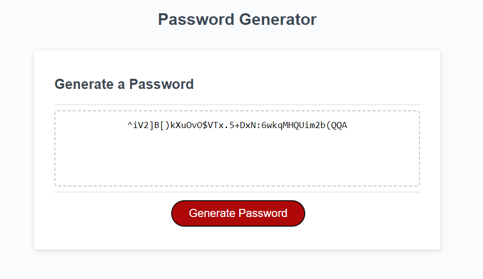

# module-05-pw-gen

## Description

The goal of this project was to create a password generator app with a polished user interface and ensuring that it is responsive and adapts to multiple screen sizes by using JavaScript, CSS and HTML.

From this project I learned and reinforced my knowledge of working with functions and APIs.

## Screenshot of Deployed Link

## Installation

Use the deployed link

## Lisence

MIT lisence

## Repo Link

https://github.com/YusufMbk/module-05-pw-gen

## Deployed Link

https://yusufmbk.github.io/module-05-pw-gen/

